# Playing-With-Optimizers-in-DL
Using different optimizers for a comparison study, finding the root of differences by visualization and to find the best case for a specific task

[[GIF credit](https://www.analyticsvidhya.com/blog/2021/06/guide-to-gradient-descent-and-its-variants-with-python-implementation/)]

` - Note: In an another repo we discuss about different optimization algorithms with visualiation on different function by simulation but here we take a real life dataset and apply different Well Known optimizers for optimizinig loss function ` 

# Contents:
 1. Our main goal
 2. About the Task
 3. About the Dataset
 4. About the model ( we will use for )
 5. Comparision Study and regarding Explaination with code
 - **1.  Discussion with Theory of each optimizers**
     - SGD ( vanila and MINI Batch )
     - SGD with momentum (including Nestrove )
     - Adagrad ( adaptive previous gradient to control LR )
     - RMSprop ( making the lr automatically adjusted )
     - Adadelta ( modification of Adadelta )
     - Adam ( )
 
 
# Our main Goal :
We have seen that for convex loss function it is easy to get the set of parameters which minimise the function using GD or anyother modification of that but in case of non-convex loss function it's too hard to get the global minima. And we have also seen that all the DL models having non-linearity result in non-convex loss function having many local minima and sadle points, [check here](https://www.quora.com/How-can-you-prove-that-the-loss-functions-in-Deep-Neural-nets-are-non-convex).So vanila-GD will not work well here and we need more modification on that. There are few well known modifications such as Nestrove, Adagrad, RMSprop, Adadelta, Adam, etc.But none of these are perfect for any kind of loss functions. But some of them works well in most cases. Here we will see which one will be better for our specific task. The task is described below-
            
# About the Task:
Here we will take text classification as our task to implement all the different optimizers. We shall take an inbuild dataset from tenserflow ( named imdb ). Then shall build a simple model ( named TextCNN ). After preprocessing and seperating test and validation data from training data. Then we shall train the model (taking "binary_crossentropy" as loss function and "accuracy" as metric) again and agian with different combination of learning rate aa optimizers and also changing other hyperparamers too. We shall follow the change each time and try to give a probable explanation. In DL it is hard to say surely about anything regarding the peremeter space (some times few Milion of dimention) but we can  guess with some generaal knoledege. Let's see.

# About the dataset:
For this study we can take any dataset, any ask and any method. But I here choose "idbm" data. "IMDb is an online database of information related to films, television programs, home videos, video games, and streaming content online – including cast, production crew and personal biographies, plot summaries, trivia, ratings, and fan and critical reviews."  
                "The IMDB sentiment classification dataset consists of 50,000 movie reviews from IMDB users that are labeled as either positive (1) or negative (0). The reviews are preprocessed and each one is encoded as a sequence of word indexes in the form of integers. The words within the reviews are indexed by their overall frequency within the dataset. For example, the integer “2” encodes the second most frequent word in the data. The 50,000 reviews are split into 25,000 for training and 25,000 for testing.
                The dataset was created by researchers at Stanford University and published in a 2011 paper, where they achieved 88.89% accuracy. It was also used within the “Bag of Words Meets Bags of Popcorn” Kaggle competition in 2011."

Here we see hoe it is given:
<!-- 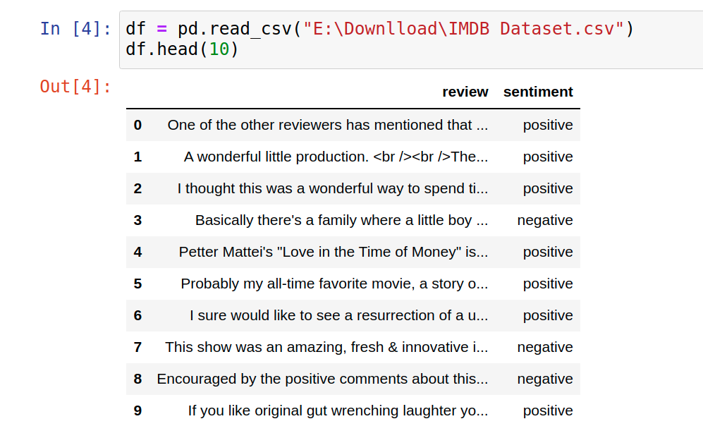 -->


> One `POSITIVE` senitment is given here as you are provided from the Tensorflow:

        (1,   14,   22,
          16,   43,  530,  973, 1622, 1385,   65,  458,    2,   66, 3941,
           4,  173,   36,  256,    5,   25,  100,   43,  838,  112,   50,
         670,    2,    9,   35,  480,  284,    5,  150,    4,  172,  112,
         167,    2,  336,  385,   39,    4,  172,    2, 1111,   17,  546,
          38,   13,  447,    4,  192,   50,   16,    6,  147, 2025,   19,
          14,   22,    4, 1920,    2,  469,    4,   22,   71,   87,   12,
          16,   43,  530,   38,   76,   15,   13, 1247,    4,   22,   17,
         515,   17,   12,   16,  626,   18,    2,    5,   62,  386,   12,
           8,  316,    8,  106,    5,    4, 2223,    2,   16,  480,   66,
        3785,   33,    4,  130,   12,   16,   38,  619,    5,   25,  124,
          51,   36,  135,   48,   25, 1415,   33,    6,   22,   12,  215,
          28,   77,   52,    5,   14,  407,   16,   82,    2,    8,    4,
         107,  117,    2,   15,  256,    4,    2,    7, 3766,    5,  723,
          36,   71,   43,  530,  476,   26,  400,  317,   46,    7,    4,
           2, 1029,   13,  104,   88,    4,  381,   15,  297,   98,   32,
        2071,   56,   26,  141,    6,  194,    2,   18,    4,  226,   22,
          21,  134,  476,   26,  480,    5,  144,   30,    2,   18,   51,
          36,   28,  224,   92,   25,  104,    4,  226,   65,   16,   38,
        1334,   88,   12,   16,  283,    5,   16,    2,  113,  103,   32,
          15,   16,    2,   19,  178,   32)
          
    if with the help of dictionary provided we want to read that, that will look like this:
            
```
            and you could just imagine being there robert # is an amazing actor and now the same being director # father came from the same # island as myself so i loved the fact there was a real connection with this film the witty # throughout the film were great it was just brilliant so much that i bought the film as soon as it was released for # and would recommend it to everyone to watch and the fly # was amazing really cried at the end it was so sad and you know what they say if you cry at a film it must have been good and this definitely was also # to the two little # that played the # of norman and paul they were just brilliant children are often left out of the # list i think because the stars that play them all grown up are such a big # for the whole film but these children are amazing and should be # for what they have done don't you think the whole story was so lovely because it was true and was # life after all that was # with us all
```
            
            
            
> One `NEGATIVE`  is given here as you are provided from the Tensorflow:
        
        (1,   14,   47,
           8,   30,   31,    7,    4,  249,  108,    7,    4,    2,   54,
          61,  369,   13,   71,  149,   14,   22,  112,    4, 2401,  311,
          12,   16, 3711,   33,   75,   43, 1829,  296,    4,   86,  320,
          35,  534,   19,  263,    2, 1301,    4, 1873,   33,   89,   78,
          12,   66,   16,    4,  360,    7,    4,   58,  316,  334,   11,
           4, 1716,   43,  645,  662,    8,  257,   85, 1200,   42, 1228,
        2578,   83,   68, 3912,   15,   36,  165, 1539,  278,   36,   69,
           2,  780,    8,  106,   14,    2, 1338,   18,    6,   22,   12,
         215,   28,  610,   40,    6,   87,  326,   23, 2300,   21,   23,
          22,   12,  272,   40,   57,   31,   11,    4,   22,   47,    6,
        2307,   51,    9,  170,   23,  595,  116,  595, 1352,   13,  191,
          79,  638,   89,    2,   14,    9,    8,  106,  607,  624,   35,
         534,    6,  227,    7,  129,  113)
         
 
    if with the help of dictionary provided we want to read that, that will look like this:
```
                this has to be one of the worst films of the # when my friends i were watching this film being the target audience it was aimed at we just sat watched the first half an hour with our # touching the floor at how bad it really was the rest of the time everyone else in the theatre just started talking to each other leaving or generally crying into their popcorn that they actually paid money they had # working to watch this # excuse for a film it must have looked like a great idea on paper but on film it looks like no one in the film has a clue what is going on crap acting crap costumes i can't get across how # this is to watch save yourself an hour a bit of your life
```
         
* Ultimatly you can make a dataframe or if you download the dataset from any other source you will get like this,


[I did someting different from what is generally done, you can see from the below plot, I took 25,000 training 15,000 validation and 10,000 test data. The classes are shown by colour, the positive class in each section is 12500, 7473, and 5027 respectively]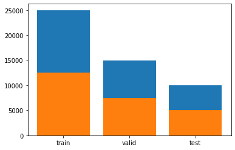


# About the Model:
             For this ask we take TEXTCNN as our DL MODEL. But for only the classificationtask you can use others also.
             
TextCNN was proposed in the paper [Convolutional Neural Networks for Sentence Classification.](http://www.aclweb.org/anthology/D14-1181)

* **Description in Paper**
<!--  -->

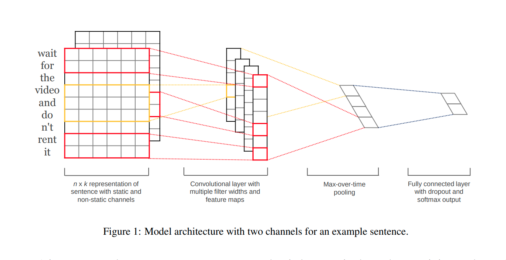
- Represent sentence with static and non-static channels.
- Convolve with multiple filter widths and feature maps.
- Use max-over-time pooling.
- Use fully connected layer with dropout and softmax ouput.

#### **Network structure of TextCNN:**


<!--  -->

#### 
Note: Here we  used notation from the [paper](https://arxiv.org/pdf/1609.04747.pdf) and also taken some portion of thery from there. So, it will be better if you can go through the paper once. 
The plots that are used below for explanation are just to show the result, not to gain the best result


# Discussion on each optimizer with Theory:


## SGD:
### Theory:
As we know there are three variants of gradient descent, which differ in how much data we use to compute the gradient of the loss function. Depending on that, we make a trade-off between the accuracy of the parameter update and the time it takes to perform an update.

**Vanilla gradient descent** which is also known as batch gradient descent computes the gradient of the cost function w.r.t. to the parameters w for the entire training dataset:  w = w − α·∇wJ(w) . As we calculate the gradients for the whole dataset to perform just one update, batch gradient descent can be very slow and if the datset is large enough that don't fit in memory.But batch gradient descent is guaranteed to converge to the global minimum for convex error surfaces and to a local minimum for non-convex surfaces.

**Stochastic gradient descent (SGD)** in contrast performs a parameter update for each training example 
x(i) and label y(i): w = w − α·∇wJ(w;x(i);y(i)) . SGD don't do the redundancy of calculating gradient on same sample agin and again by performing one update at a time. It is therefore usually much faster.SGD performs frequent updates with a high variance that cause the objective function to fluctuate heavily.
While batch gradient descent converges to the minimum of the basin the parameters are placed in, SGD's fluctuation, on the one hand, enables it to jump to new and potentially better local minima. On the other hand, this ultimately complicates convergence to the exact minimum, as SGD will keep overshooting. However, it has been shown that when we slowly decrease the learning rate, SGD shows the same convergence behaviour as batch gradient descent, almost certainly converging to a local or the global minimum for non-convex and convex optimization respectively. We will see varients of sgd later here.

**Mini-batch gradient descent**
Mini-batch gradient descent finally takes the best of both worlds and performs an update for every mini-batch of 
n training examples: w = w − α · ∇wJ(w; x(i:i+n); y(i:i+n)) 
This way, it a) reduces the variance of the parameter updates, which can lead to more stable convergence; and b) can make use of highly optimized matrix optimizations common to state-of-the-art deep learning libraries that make computing the gradient w.r.t. a mini-batch very efficient. Common mini-batch sizes range between 50 and 256, but can vary for different applications. Mini-batch gradient descent is typically the algorithm of choice when training a neural network and the term SGD usually is employed also when mini-batches are used.


###  **Experiment results:**

#### Vanila SGD::

#### Mini batch::

Model compexity level:
epochs:
batch size:
learning rate:
other hyperparameters:


## Momentum:
SGD oscillates across the slopes of the ravine where the surface curves much more steeply in one dimension than in another while only making hesitant progress along the bottom towards the local optimum as in the Image

SGD without momentum
Image 1: SGD without momentum 

Image 2: SGD with momentum 

Momentum is a method that helps accelerate SGD in the relevant direction and dampens oscillations as can be seen in Image 2.

Instead of depending only on the current gradient to update the weight, gradient descent with momentum replaces the current gradient with m (“momentum”), which is an aggregate of gradients. This aggregate is the exponential moving average of current and past gradients (i.e. up to time t). Later we shall see that this momentum update becomes the standard update for the gradient component for most optimisers.


<!-- 


where
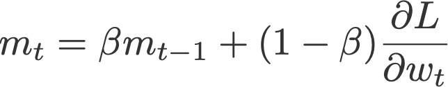
and m initialised to 0.
Common default value: The momentum term β is usually set to 0.9 or a similar value.


We can think momentum in the case when we push a ball down a hill. The ball accumulates momentum as it rolls downhill, becoming faster and faster on the way where as any human is same as the case without momentum. The same thing happens to our parameter updates: The momentum term increases for dimensions whose gradients point in the same directions and reduces updates for dimensions whose gradients change directions. As a result, we gain faster convergence and reduced oscillation.


**Nesterov accelerated gradient**
However, a ball that rolls down a hill, blindly following the slope, is highly unsatisfactory. We'd like to have a smarter ball, a ball that has a notion of where it is going so that it knows to slow down before the hill slopes up again.

This update utilises m, the exponential moving average of what we would call projected gradients.

where
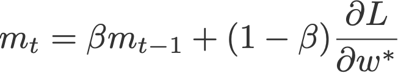
and m initialised to 0.
The last term in the second equation is a projected gradient. This value can be obtained by going ‘one step ahead’ using the previous velocity (Eqn. 4).


Nesterov accelerated gradient (NAG) is a way to give our momentum term this kind of prescience. We know that we will use our momentum term γ.v(t−1)  to move the parameters w. Computing w−γ.v(t−1) , thus gives us an approximation of the next position of the parameters (the gradient is missing for the full update), a rough idea where our parameters are going to be. We can now effectively look ahead by calculating the gradient not w.r.t. to our current parameters w but w.r.t. the approximate future position of our parameters:
vt = γ v(t−1) + α∇wJ( w − γv(t−1) )
w = w − vt

Again, we set the momentum term γ to a value of around 0.9. While Momentum first computes the current gradient (small blue vector in Image 4) and then takes a big jump in the direction of the updated accumulated gradient (big blue vector), NAG first makes a big jump in the direction of the previous accumulated gradient (brown vector), measures the gradient and then makes a correction (red vector), which results in the complete NAG update (green vector). This anticipatory update prevents us from going too fast and results in increased responsiveness, which has significantly increased the performance of RNNs on a number of tasks [7].
 
Now that we are able to adapt our updates to the slope of our error function and speed up SGD in turn, we would also like to adapt our updates to each individual parameter to perform larger or smaller updates depending on their importance.


# Adagrad
Adagrad is an algorithm for gradient-based optimization that does just this: It adapts the learning rate to the parameters, performing smaller updates
(i.e. low learning rates) for parameters associated with frequently occurring features, and larger updates (i.e. high learning rates) for parameters associated with infrequent features. For this reason, it is well-suited for dealing with sparse data. Dean et al. have found that Adagrad greatly improved the robustness of SGD and used it for training large-scale neural nets at Google, which -- among other things -- learned to recognize cats in Youtube videos. Moreover, Pennington et al. used Adagrad to train GloVe word embeddings, as infrequent words require much larger updates than frequent ones.

#######
#######
Adaptive gradient, or AdaGrad (Duchi et al., 2011), acts on the learning rate component by dividing the learning rate by the square root of v, which is the cumulative sum of current and past squared gradients (i.e. up to time t). Note that the gradient component remains unchanged like in SGD.

where
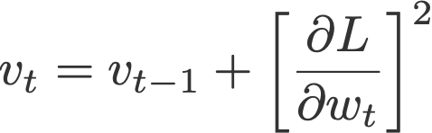
and v initialised to 0.
Notice that ε is added to the denominator. Keras calls this the fuzz factor, a small floating point value to ensure that we will never have to come across division by zero.
Default values (from Keras):
α = 0.01
ε = 10⁻⁷


One of Adagrad's main benefits is that it eliminates the need to manually tune the learning rate. Most implementations use a default value of 0.01 and leave it at that.

Adagrad's main weakness is its accumulation of the squared gradients in the denominator: Since every added term is positive, the accumulated sum keeps growing during training. This in turn causes the learning rate to shrink and eventually become infinitesimally small, at which point the algorithm is no longer able to acquire additional knowledge. The following algorithms aim to resolve this flaw.


# RMSprop
Root mean square prop or RMSprop (Hinton et al., 2012) is another adaptive learning rate that tries to improve AdaGrad. Instead of taking cumulative sum of squared gradients like in AdaGrad, we take the exponential moving average (again!) of these gradients. Similar to momentum, we will slowly see that this update becomes the standard update for the learning rate component for most optimisers.

where
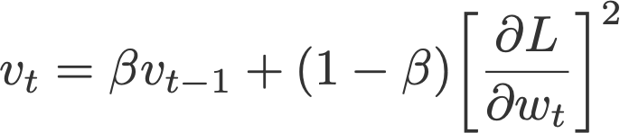
and v initialised to 0.
Default values (from Keras):
α = 0.001
β = 0.9 (recommended by the authors of the paper)
ε = 10⁻⁶


# Adadelta 
Like RMSprop, Adadelta (Zeiler, 2012) is also another improvement from AdaGrad, focusing on the learning rate component. Adadelta is probably short for ‘adaptive delta’, where delta here refers to the difference between the current weight and the newly updated weight.
The difference between Adadelta and RMSprop is that Adadelta removes the use of the learning rate parameter completely by replacing it with D, the exponential moving average of squared deltas.
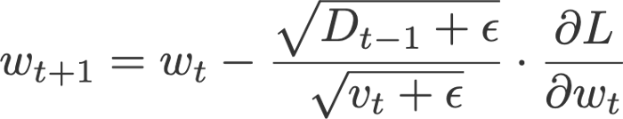
where
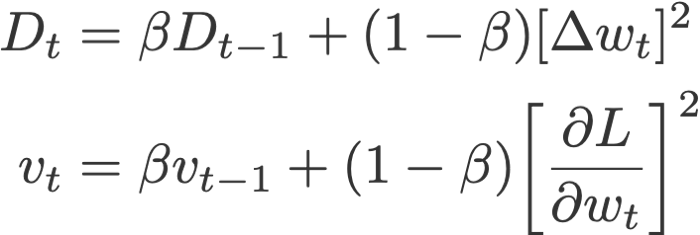
with D and v initialised to 0, and
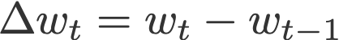
Default values (from Keras):
β = 0.95
ε = 10⁻⁶


# Adam 
Adaptive moment estimation, or Adam is simply a combination of momentum and RMSprop. It acts upon
the gradient component by using m, the exponential moving average of gradients (like in momentum), and
the learning rate component by dividing the learning rate α by square root of v, the exponential moving average of squared gradients (like in RMSprop).
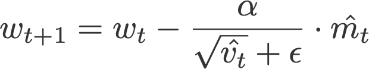
where
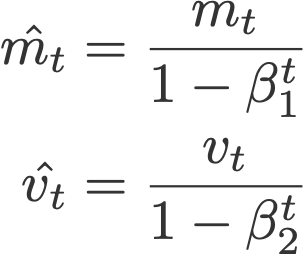
are the bias corrections, and
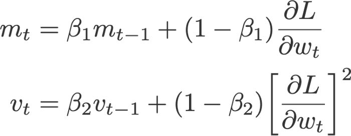
with m and v initialised to 0.
Proposed default values by the authors:
α = 0.001
β₁ = 0.9
β₂ = 0.999
ε = 10⁻⁸


 
 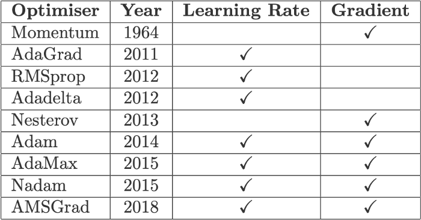
<!-- width="220" height="220" -->
-->
