# Optimization-Algorithm
For learning, visualizing and understanding the optimization techniques and algorithms.
#
#
#

Visualizations and in depth concepts of the Machine Learning optimization algorithms are discussed and shown here with different functions as examples and understanding the differences by comparing  them.
## Over all types of Line and direction search algorithms in Gradient Descent discussed here: :shipit:
- Line search & direction search in Gradient Descent:
  - >> Exact Methods:
    - > Using derivatives ( for differentiable functions only):
      - Newton's method
      - Secant Method
    - > Without using derivatives (require function evaluation only):
      - Golden Section
      - Fibonacci
      - Bisection
  - >> Inexact method  (step length found is not exactly optimal )  {these are parameter specific}:
      - Armijo
      - Wolf-Powell

# 
<!-- * Line search & direction search in Gradient Descent:
+     Exact Methods:
*         Using derivatives ( for differentiable functions only):
*             Newton's method
*             Secant Method
*         Without using derivatives (require function evaluation only):
*             Golden Section
*             Fibonacci
*             Bisection
*     Inexact method  (step length found is not exactly optimal )  {these are parameter specific}:
*         Armijo
*         Wolf-Powell -->

Here All optimization techniques are explained through code. You can find the codes inside the ipynb files along with some explanation. The codes are very simple to understand :speak_no_evil: , if the theory is clear to you. ( In future I will put some easy explanation and theory here )
First go through the file " complete_OPTAL.ipynb" then go through "GD_SGD_MNGD_momentum.ipynb" initially with the pdf. If you want to visualize the pots in other way checkout the "collection_of_plots.ipynb" . Now continue reading :point_down:

# 
# But What Is Gradient descent actually? :thinking: :thinking: :thinking:
# 
Let's discussed about Gradient Descent. If you started your Machine Learning course, you already started minimizing your Loss function. So you need to find the **optimum parameters** which minimize the function. The **loss function** may be of different kinds and may be **convex, concave** or both or may contain **saddle points**. If it is a least square loss then it is a quadratic function and definitely it is a convex function. And initially we assign **random values** to the parameters and then use different libraries to solve for optimum values of the parameters. 

### **But what goes behind the scene will be discussed here.**
So, for now forget everything just **listen to the**  :shushing_face: . Climbing down a hill is a nice example to describe Gradient Descent. Butu here is another one. Suppose you live in USA and your friend lives in DELHI in India :hand_over_mouth: .You want to visit to your friend's house. You have no information about the way to reach him. So initially you have the task to somehow reach  India. Now suppose askig to a person near airport you came to know that you have to take flight to Mumbai(another city of India)(one of the simple way to reach India, even simpliest), so, you land in Mumbai.
So, again for that time being you don't know the way to reach him, so, by asking a station master you came to know that if you want to go to somewhere in Delhi, you have to take a train to Delhi from there , so, you have the curent information that you have to go to DELHI from MUMBAI. So from there you directly reach a train station in Delhi. Now you have reached Delhi, so you are near to your friend house. And now you have to remind about your friend profession, in which company he works etc. So basically you have to use some more detailed and sensitive information now to perfectly locate friend's pisition. So as you can remember your friend works on Google, so you visit the nearest Google office there. From there you again gain some more information about the exact location of the flat he lives. In this way by asking some local people, flat keeper you reach the flat and found the room of your friend. So, basically what you did is you moved directly to the next place on the basis of the information you gained in the current place by asking people.   
Gradient Descent is the process in which we try to find the minimum function valued point starting from any arbitary point. And this works exactly same as you did. Initially we will have no information about the optimum point, but have the current information about the approximate direction(gradient direction) we should go for a optima. Similarly you also didn't have the detailed information and used the current information every time. Here  the world map is comparable to the function, the current update or information in any point is comparable to the gradient information of the function on that point. Near the optima we feel tough and get stuck many times as you felt after reaching Delhi and asked many people where the flat is located as you were known about your friend not about the path, like we know some characteristics about the optimum point that there the gradient value is zero etc.
And for a single move you first decided where to go from where and then choose train,bus etc. Similarly to make a step from any point to next point we go towards the direction of the gradient of the function. So after knowing the direction we fix the step size that is how much we want to move in that direction. 

**_So first find direction to move and then find the learning rate_**  , Learning Rate controls how much to move in that direction. When you feel the **vanilla gradient descent** :zipper_mouth_face: is not working well then you must use your knowledge to get a optimum direction as well as an optimum dynamic step length or learning rate. And by adding more parameter to GD we get the optimum point often quickly and don't get stuck any other stationary points, local minima, saddle point etc. So we will see code for Gradient Descent and then move to the modified versons of that. Next we will see **SGD** and problems introduced in SGD and how to get rid of those problems by introducing **momentum, regularization** etc. 

# 
### Example of Some Bivariate Functions: :+1:
Here we go,
First some visualizations of functions will definitely make you curious to know more about the optimization, so, 
look at the functions think how to find the minimum starting from a arbitrary point,

=\frac{sin(10(x^2+y^2))}{10}) 
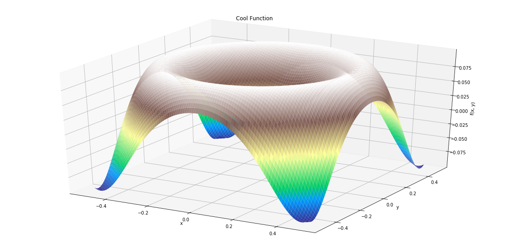

We will work with simple univariate and bivariate functions for understanding,:yawning_face: One convex and one non-convex function is shown below,
<!-- - 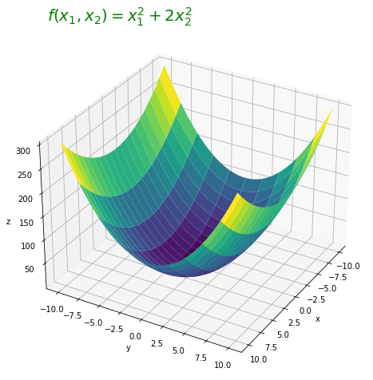     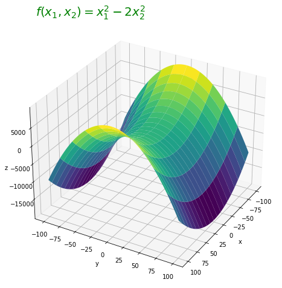 -->

[convex surface]
[concave surface]

<!-- 

    

  

       

     

 -->
  
  
You can visualize some nice simple functions and other complex functions like Rosenbrock function :astonished: in the ipynb.
  
  
# 
We will go like this:
- [x] GD
- [x] SGD 
- [x] MINI BATCH  
- [x] MOMENTUM IN GD
### GD in Univariate function:

Next I will show some plots by which you will get some interest about Gradient descent,
Now see how zigzagging happens while reaching the minima starting from an arbitrary point, in the left side the value of the parameter is shown with iteration and in the right side function values are shown

Here you can see how step size gradually decrease near optima, and the ideal approximation of step length is shown with iteration using Armijo rule,
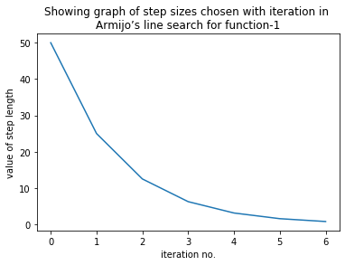

To reduce this long zigzag path we need to adjust learning rate or other parameters or need to apply various methods, after using these, as you can see below the zigzagging reduced ..again ignore all other terms just follow the curves, later you can understand why and how this hes been happened.
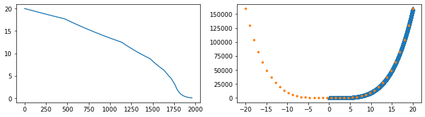

# 
### GD in Bivariate function:

Now the same thing for a bivariate function is shown in a contour plot, latter you can visualize it in a 3d plot also:
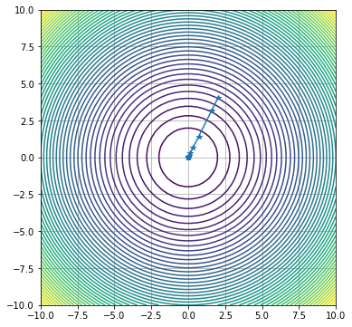
  
- [x] GD :tada:
- [ ] SGD 
- [ ] MINI BATCH  
- [ ] MOMENTUM IN GD

  
# 
### SGD in Bivariate function ( perturbed GD):

Now come to SGD[ stochastic gradient descent]
As we are not dealing with dataset directly, but in Machine Learning SGD means we minimise the loss function each time for a single data point, as a result each time structure and minima get changed and it is highly stochastic. But when we take the data by batch it is called minibatch GD, SO in minibatch gradient descent we minimise the loss function for a complete batch, and clearly in this case the randomness or stochastic nature of the structure of the loss function is less. :see_no_evil:  we here take simulation of that by adding random noise from normal distribution, and then follow how the difficulty is getting increased by adding this noise, and this problem looks like a **Stochastic Gradient Descent** problem, latter we will reduce this noise by taking average of some random noise to simulate the **Mini BAtch Gradient Descent** ( OK, so you have to be good with random numbers in python, :writing_hand: Here I attached one plot to get you idea how you can play with it to see differences) Follow the sampling, i.e, sample number and its distribution, When the sample variance is large this is a simulation of SGD and when the variance is low this is same as a  Mini Batch GD.
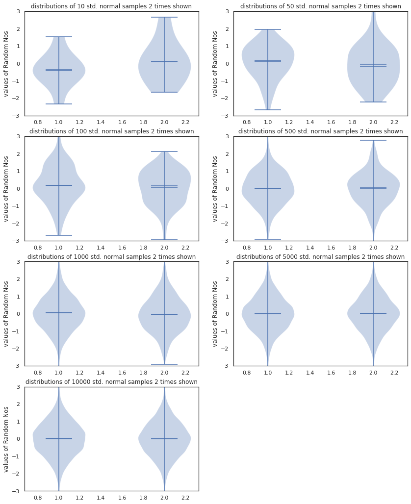
  

# 
## Dynamic step size:
As we have added noise to perform a SGD, it becomes tough now to reach the minima within affordable iteration number. So, for that we have to control the step size wisely(in the plot below, the step size is polynomially controlled for other methods go to the first portion of the "GD_SGD_MBGD_momentum.ipynb"). In the figure below, The change of the parameters, function value, function value near minima, gradient norm value step size is shown with iteration. Also you can visualize how the minima is reached in a contour plot as well as in a 3d plot.

- 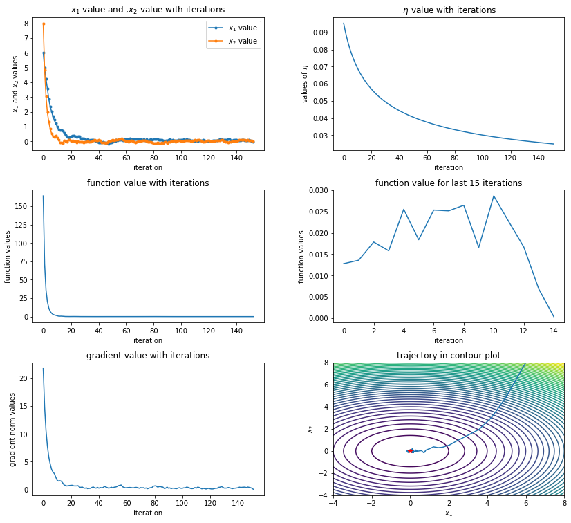 - 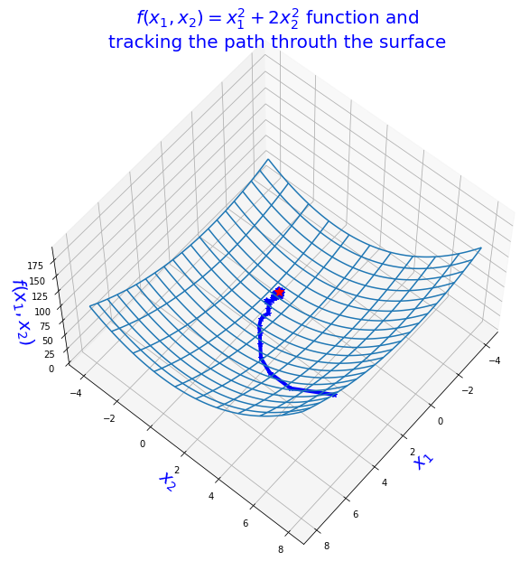
  
  
# 
## Comparison of different methods of dynamic step size:
Here polynomially decreases step size is used but you can use exponential functions to handle  , or you may keep it constant or step wise decreasing, a plot showing comparison among these different methods are shown here,,, these different methods behave differently in different function, so be careful. But in most cases Polynomially decreasing  is doing better control. The below methods are discussed inside the ipynb file.
- [x] Constant Learning Rate ,i.e value of  is constant with iteration. As a result step length will decrease with decrease in gradient value
- [x] Step Wise decreasing LR , i.e, LR is reduced by a fraction when function balue in any iteration is increased
- [x] Exponentially decresing LR with iteration 
- [x] Polynomially decreasing LR
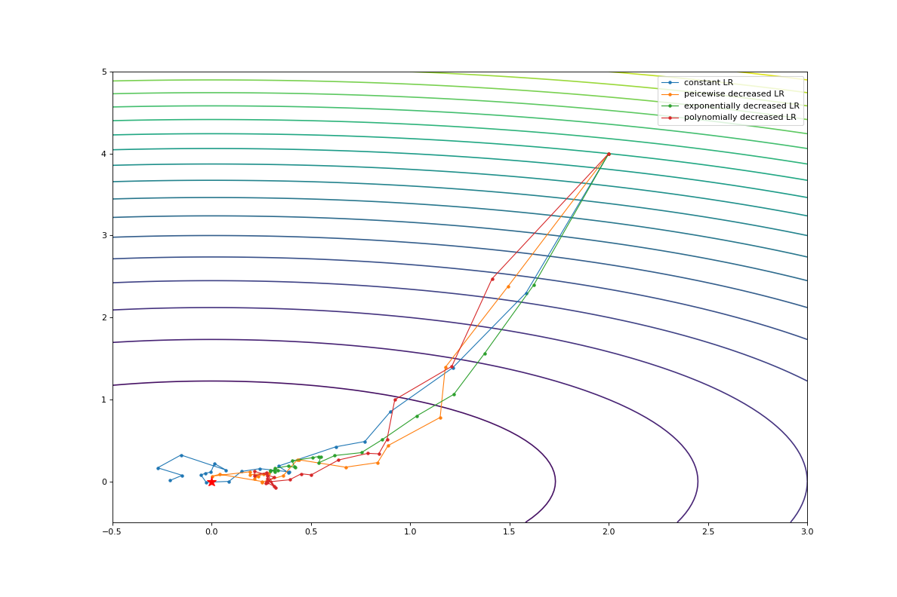

  
# 
## For the non-convex Surface:
Finally we will see how tough this is for a non-convex surface ( the function used here is shown above   ),

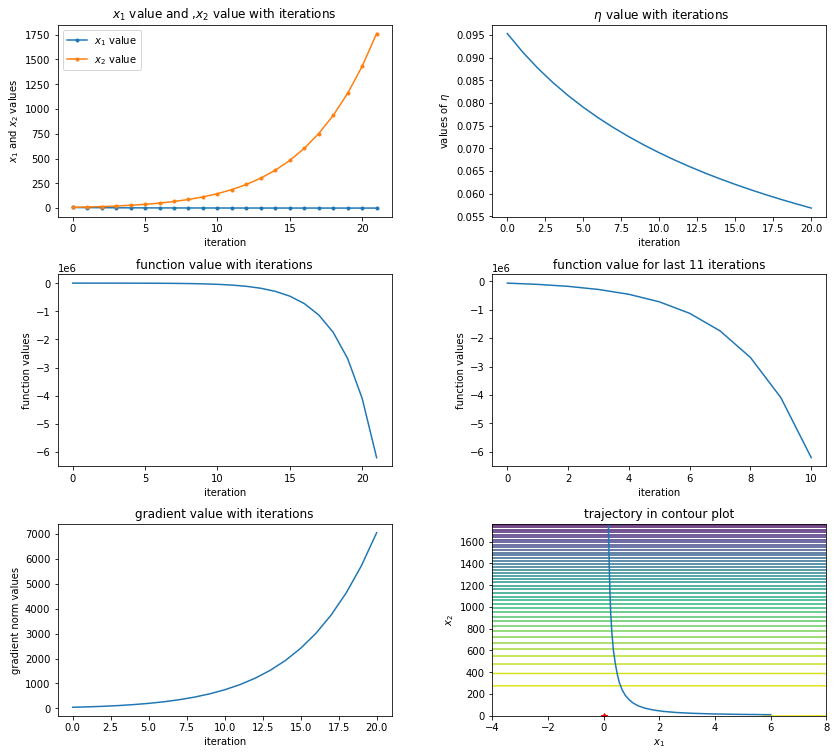
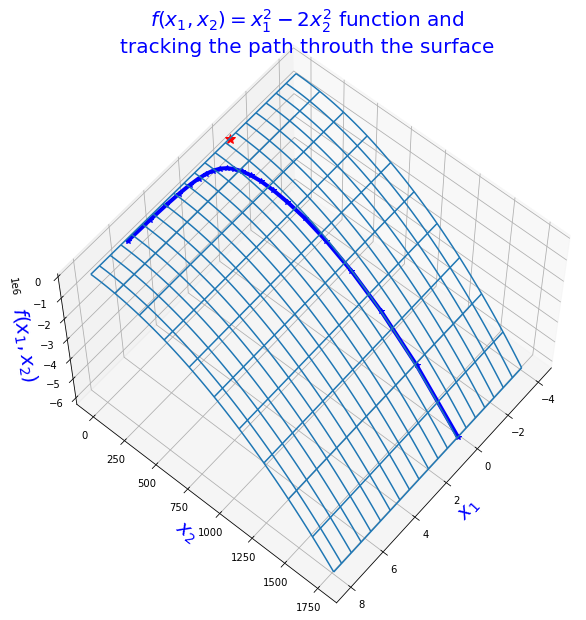

- [x] GD :tada:
- [x] SGD :tada:
- [x] MINI BATCH :tada:  
- [ ] MOMENTUM IN GD

  
# 
## Momentum updation in GD:
And finally We will use momentum updation to handle these difficulties. Momentum help the point keep going in a direction resultant of its momentum at that point and gradient and helps not to stuck in local minima or saddle point. Here to show the change I purposefully kept the momentum parameter high, so you can see that though it know in which direction the minima is , but it will take its momentum in consideration. As a result it takes a long way, but if you reduce momentum controlling parameter it will help,

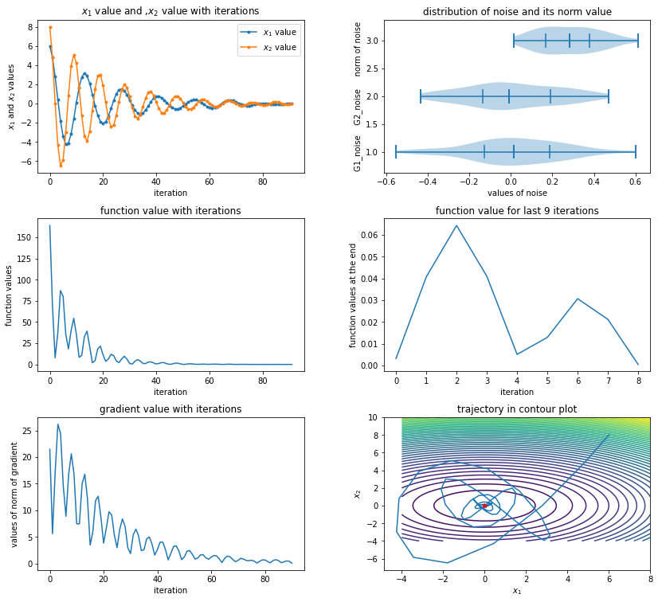
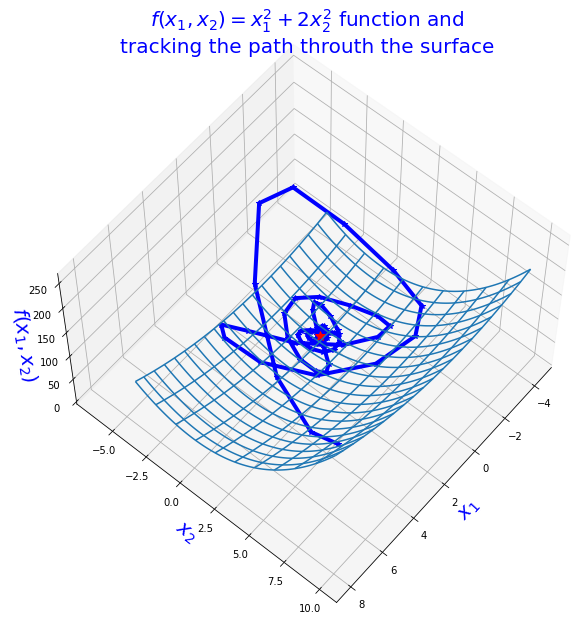
Thats it. Go to the ipynb files now.
  

- [x] GD :tada:
- [x] SGD :tada:
- [x] MINI BATCH :tada:  
- [X] MOMENTUM IN GD :tada:
  
  
**
Also I think, it will be better if anyone want to help me by just making the ipynb files more understandable by separation the topics.
If you feel hard anywhere, contact me in mahendranandi.0608@gmail.com

HAve You Any Suggestion For Me? Please , you are welcome to inform me here or drop a message in [LinkedIn](https://www.linkedin.com/in/mahendra-nandi-7038b8176/)

**

<!--  -->
